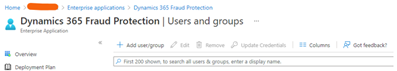

## Title

This section covers how to use Dynamics 365 Fraud Protection Power Apps connector.

## Obtaining credentials

This connector supports both user account and service principal authentication. Typically this connector is called from Power Automate. In Power Automate, you need to configure connector authentication.

### User account authentication

1. Create a new user following the steps to [Add a new user](https://docs.microsoft.com/azure/active-directory/fundamentals/add-users-azure-active-directory#add-a-new-user).

2. Assign the new user to Risk_Api role in Dynamics 365 Fraud Protection.

3. Go to **Enterprises applications** in Azure Active Directory. Select **Microsoft Applications** as the **Application Type**, and then type "Dynamics 365 Fraud Protection" in the search.

   

4. Select **Dynamics 365 Fraud Protection**.

   

5. Select **Users and groups**. Select **Add user/group**.

   

   

6. Select **Users**, and enter the user name.

   

7. Click **Select a role**. Select **Risk_Api role** and then click **Select**. Select **Assign**.

   

   

### Service principal

Assign the new user to Risk_Api role in Dynamics 365 Fraud Protection.

1. Go to [https://dfp.microsoft.com/](https://dfp.microsoft.com/).
2. Select **Integration (preview)**
3. Select **Create new application** in "Step 1: Enable core integration".

    

4. Enter the application display name, select the secret option, and then select **Create application**.
5. In the next screen, copy application (client) ID and client secret. You need to use these values to configure the connector connection.

## Host URL

This connector requires a host URL. You can find the host URL at [https://dfp.microsoft.com/](https://dfp.microsoft.com/).

1. Browse to [https://dfp.microsoft.com/](https://dfp.microsoft.com/).
2. Select **Integration (preview)**.
3. Set the host URL with as the API endpoint value.

  
