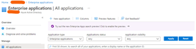
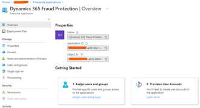
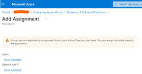
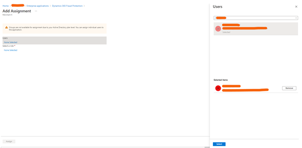
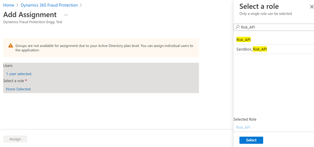
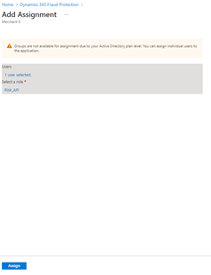
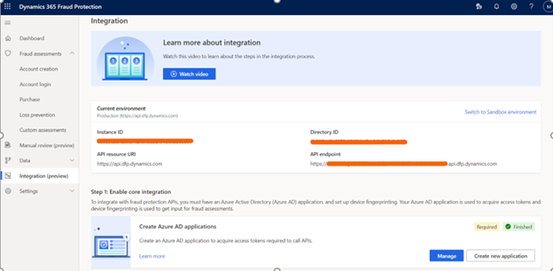

## Title

This section covers how to use Dynamics 365 Fraud Protection Power Apps connector

## Obtaining Credentials

This connector supports both user account and service principal authentication. Typical this connector is called from Power Automate and in Power Automate, you need to configure authentication.

### User Account Authentication

1. Create a new user using this [link](https://docs.microsoft.com/en-us/azure/active-directory/fundamentals/add-users-azure-active-directory#add-a-new-user)

2. Assign the new user to Risk_Api role in Dynamics 365 Fraud Protection Application.

   - Go to "Enterprises applications" in Azure Active Directory. Select "Microsoft Applications" as Application Type and type "Dynamics 365 Fraud Protection" in the search

   

   - Click on "Dynamics 365 Fraud Protection"

   

   - Click on "Users and groups" - Click on "Add user/group"

   

   

   - Click on Users, enter the user name and the select the user name

   

   - Click on 'Select a role', click on "Risk_Api role and click on "Select" - Click on Assign

   

   

### Service principal

- Assign the new user to Risk_Api role in Dynamics 365 Fraud Protection Application.

  - Browse to https://dfp.microsoft.com/
  - Click on "Integration (preview)"
  - Click on "Create new application" in "Step 1: Enable core integration"

    

  - Enter Application display name, select secret option and click on "Create application"
  - In the next screen, copy application (client) ID and Client secret. You need to use these values to configure the connector connection.

## Host Url

This connector requires host url. You can find the host url in https://dfp.microsoft.com

- Browse to https://dfp.microsoft.com/

  - Click on "Integration (preview)"
  - Set the host url with API endpoint value

  
